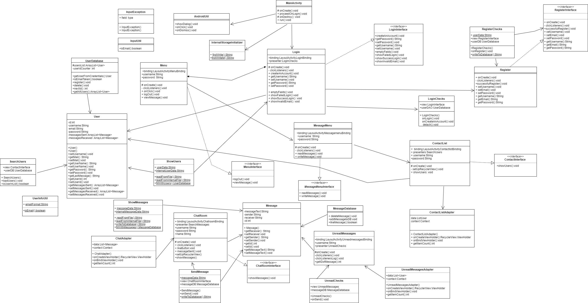

# Grasp-it
## Social Media Application - Ομαδική εργασία - Προγραμματισμός ΙΙ

### Οδηγίες μεταγλώττισης
Η μεταγλώττισή της εφαρμογής πραγματοποιείται μέσω της οδηγίας build του εργαλείου gradle, όπως αυτό χρησιμοποιείται από το περιβάλλον του Android Studio.

### Οδηγίες εκτέλεσης
Η εκτέλεσή της γίνεται μέσω του emulator του ***Android Studio***.

### Οδηγίες χρήσης 
Κατά τη χρήση της εφαρμογής:

➜ Ένας νέος χρήστης μπορεί να συνδεθεί στην εφαρμογή, συμπληρώνοντας τα απαραίτητα στοιχεία:
   **Όνομα, Επώνυμο, Διεύθυνση Ηλεκτρονικού Ταχυδρομείου, Username** και **Κωδικό Πρόσβασης**. 
   Το ***Username*** και η ***Διεύθυνση Ηλεκτρονικού Ταχυδρομείου*** δεν θα πρέπει να εμπίπτουν σε αυτά άλλων χρηστών, διαφορετικά θα ζητηθεί από τον χρήστη να συμπληρώσει ξανά τα στοιχεία του.

➜ Οι χρήστες μπορούν να συνδεθούν συμπληρώνοντας το ***Username*** και τον ***Κωδικό Πρόσβασής*** τους.

➜ Αφού συνδεθούν, οι χρήστες μπορούν να εισέλθουν στις αρχικές αίθουσες της εφαρμογής, όπου μπορούν να περιηγηθούν στα δωμάτια 
   συνομιλίας ή να εξέλθουν από την εφαρμογή.

➜ Στα δωμάτια ανάγνωσης νέων μηνυμάτων προβάλλονται όλα τα νέα μηνύματα που λαμβάνει ο χρήστης, καθώς και ο αποστολέας του κάθε 
   μηνύματος. Ταυτόχρονα, ο χρήστης έχει τη δυνατότητα να κάνει αντίδραση ***like*** στα μηνύματα που επιλέγει με την πληκτρολόγηση του 
   μοναδικού κωδικού κάθε μηνύματος.

➜ Στα δωμάτια αποστολής, οι χρήστες πραγματοποιούν τη συγγραφή ενός νέου μηνύματος, συμπληρώνοντας το κείμενο και το όνομα του 
   παραλήπτη.

➜ Στην λίστα επαφών προβάλλονται οι επαφές με τις οποίες έχει συναναστραφεί ο χρήστης και τα τελευταία μηνύματα που στάλθηκαν στην 
   μεταξύ τους συνομιλία.

➜ Κατά τις βασικές λειτουργίες της εφαρμογής δίνεται η δυνατότητα αποσύνδεσης μέσα από τα αντίστοιχα εικονίδια εξόδου.

### Δομή περιεχομένων
Οι βασικές λειτουργίες της εφαρμογής διακρίνονται σε τέσσερις κατηγορίες αρχείων:
1) Activities
2) Database
3) Entities
4) Util.

Τα *Activities* διαμορφώνουν τις οθόνες της εφαρμογής, καθώς και τις βασικές λειτουργίες που τις πλαισιώνουν. Tα *Database* αρχεία 
αποτελούν κλάσεις που διαχειρίζονται τα στοιχεία, όπως αυτά πηγάζουν από τις βάσεις δεδομένων της εφαρμογής. Τα *Entities* 
διαχειρίζονται τις βασικές οντότητες της εφαρμογής, δηλαδή τους χρήστες και τα μηνύματα. Τέλος, τα αρχεία *Util* αξιοποιούνται για 
συγκεκριμένες εσωτερικές διεργασίες της εφαρμογής.

Παράλληλα με τις βασικές κατηγορίες αρχείων, τα αρχεία *Res* περιλαμβάνουν όλες τις γραφικές διαδικασίες για την ολοκλήρωση της 
εφαρμογής και την εμφάνισή της στην οθόνη του emulator, τα *assets* περιλαμβάνουν τα αρχεία txt με τα default δεδομένα της εφαρμογής, 
ενώ το αρχείο *Μanifest* ενεργοποιεί όλες τις κύριες λειτουργίες για την επιτυχή εκτέλεση της εφαρμογής.

Είναι σημαντικό να σημειωθεί, ότι η αποθήκευση και προσπέλαση των δεδομένων γίνεται στο *Internal Storage* του *Android Studio*.

### Διάγραμμα UML

### Δομές Δεδομένων και Αλγόριθμοι της Εφαρμογής
Κύριες εσωτερικές δομές δεδομένων που αξιοποιεί η εφαρμογή είναι τα *Arrays* και *ArrayLists*.

Κατά την υλοποίηση της εφαρμογής, έγινε χρήση αλγορίθμων ελέγχου των δεδομένων μέσω ***Searching*** και ***Sorting*** Αλγορίθμων, καθώς 
και αλγορίθμων προσπέλασης του Internal Storage του Android Studio.
